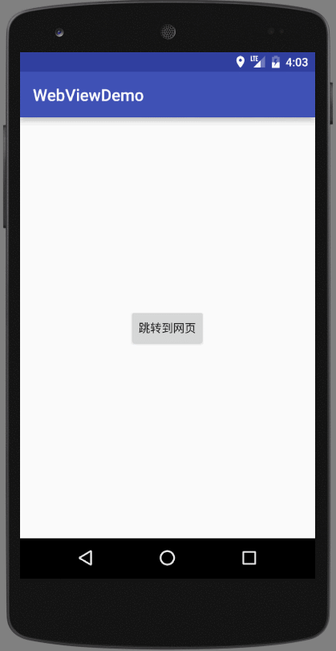

# WebViewDemo
android与web交互的demo，将WebView的activity独立出来，使其更加灵活，能处理加载不同网页的需求。

博客地址：[https://segmentfault.com/a/1190000004150350](https://segmentfault.com/a/1190000004150350)

实现内容：
- android和web相互传值
- 混淆打包注意事项处理
- 请求web时设置cookie
- 从浏览器网页打开应用

